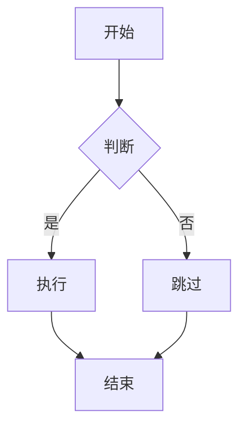

# Feishu Doc Manager

将多种格式的内容同步到飞书文档，支持文本、Markdown、图片、代码片段和图形渲染。

## 触发条件

当用户提到以下内容时触发此技能：
- "同步到飞书"
- "记录到文档"
- "更新飞书文档"
- "存到飞书"
- "Feishu Doc"
- "飞书文档"
- "Lark Docs"

## 快速开始

### 前置要求

1. **设置环境变量**（必须）
   ```bash
   # Windows PowerShell
   $env:FEISHU_APP_ID="your_app_id"
   $env:FEISHU_APP_SECRET="your_app_secret"

   # Linux/Mac
   export FEISHU_APP_ID="your_app_id"
   export FEISHU_APP_SECRET="your_app_secret"
   ```

2. **安装依赖**（如果需要渲染 Mermaid 图表，可选）

   **选择 1: 使用 pyppeteer (推荐，更稳定)**
   ```bash
   pip install pyppeteer
   ```

   **选择 2: 使用 mermaid-cli (需要 Node.js)**
   ```bash
   npm install -g @mermaid-js/mermaid-cli
   ```

   **注意**：如果不安装上述依赖，Mermaid 图表将以代码块形式显示，不影响其他功能。

### 基本使用

```bash
# 同步纯文本
python scripts/feishu_api_client.py --text "Hello Feishu" --title "测试文档"

# 同步 Markdown 文件
python scripts/feishu_api_client.py --markdown README.md --title "项目文档"

# 同步包含图片的文档
python scripts/feishu_api_client.py --markdown doc.md --images ./images --title "带图片的文档"
```

## 核心功能

### 1. 文本与 Markdown 支持

- 纯文本直接写入
- Markdown 自动转换为飞书 Block 格式：
  - `# H1` → `heading1`
  - `## H2` → `heading2`
  - `### H3` → `heading3`
  - `**bold**` → 粗体文本样式
  - `*italic*` → 斜体文本样式
  - `- 列表` → 无序列表
  - `1. 列表` → 有序列表

### 2. 图片上传

支持格式：PNG, JPG, JPEG

**重要**：飞书不允许直接引用外部 URL，必须两步操作：

1. 上传图片到飞书服务器获取 `file_token`
2. 在文档中插入 `image` block 引用 `file_token`

```bash
# 自动上传并插入图片
python scripts/feishu_api_client.py \
  --markdown doc.md \
  --image-dir ./images \
  --title "带图片的文档"
```

### 3. 代码片段

支持语法高亮的代码块：

````markdown
```python
def hello():
    print("Hello, Feishu!")
```
````

自动提取语言标识符（如 `python`）并传递给飞书 API，实现语法高亮。

### 4. Mermaid 图表渲染

支持：
- 流程图 (Flowchart)
- 时序图 (Sequence diagram)
- 其他 Mermaid 语法

**渲染流程**：
1. 本地使用 `pyppeteer` 或 `mermaid-cli` 将 Mermaid 代码渲染为 PNG
2. 上传 PNG 到飞书服务器
3. 在文档中插入图片 block

```bash
# 渲染 Mermaid 图表
python scripts/mermaid_renderer.py "graph TD; A-->B;" output.png

# 然后正常同步文档（会自动处理图片）
python scripts/feishu_api_client.py --markdown doc.md --title "图表文档"
```

## 工作流程

### 智能文档处理

逻辑：
1. **搜索文档**：先调用搜索接口查询文档名称
2. **追加 vs 新建**：
   - 如果找到 → 追加内容到现有文档
   - 如果未找到 → 创建新文档
3. **幂等性**：记录 `document_id`，支持断点续传

### 分块写入

飞书 API 限制单次最多增加 50 个 block。

自动分批处理：
- 文档内容会被分割成多个批次
- 每批最多 50 个 block
- 批次顺序执行，保证内容完整

### Preview 模式

在正式写入前，先输出结构预览：

```bash
# 启用预览模式
python scripts/feishu_api_client.py \
  --markdown doc.md \
  --title "测试文档" \
  --preview
```

预览输出示例：
```
=== 即将写入的内容结构 ===
标题：测试文档
总块数：45
批次数：1

块类型分布：
- heading1: 1
- text: 20
- code: 3
- image: 2

是否确认写入？[y/N]
```

## 指令执行流程

当用户触发此技能时，按以下步骤执行：

### Step 1: 理解需求

明确用户意图：
- 内容来源：文本、Markdown 文件、代码片段？
- 文档标题：用户指定标题还是自动生成？
- 操作类型：新建文档还是追加到现有文档？

### Step 2: 解析内容

**Markdown 解析器规则**：

```python
# 标题解析
# H1 → heading1 block
## H2 → heading2 block
### H3 → heading3 block

# 文本样式
**bold** → text_element with bold=true
*italic* → text_element with italic=true
`code` → inline code

# 列表
- item → bulleted_list
1. item → numbered_list

# 代码块
```language → code block with language attribute
```

### Step 3: 处理多媒体

**图片处理流程**：

```python
1. 扫描 Markdown 中的图片引用
   - 本地路径：
   - 相对路径：

2. 批量上传图片
   for image in images:
       file_token = upload_image_to_feishu(image_path)
       store_file_token(image_path, file_token)

3. 替换 Markdown 中的图片引用
   将  转换为 image block
```

**Mermaid 渲染流程**：

```python
1. 识别 Mermaid 代码块
   ```mermaid
   graph TD;
   A-->B;
   ```

2. 调用渲染脚本
   python scripts/mermaid_renderer.py mermaid_code output.png

3. 上传渲染后的 PNG
   file_token = upload_image_to_feishu(output.png)

4. 插入到文档
   创建 image block 引用 file_token
```

### Step 4: 构建 Block 结构

将解析后的内容转换为飞书 Block 数组：

```python
blocks = []

# 示例：标题 + 文本 + 图片
blocks.append({
    "block_type": 1,  # paragraph
    "paragraph": {
        "elements": [{
            "text_run": {
                "content": "这是标题",
                "text_element_style": {
                    "bold": True
                }
            }
        }]
    }
})

blocks.append({
    "block_type": 1,  # paragraph
    "paragraph": {
        "elements": [{
            "text_run": {
                "content": "这是正文内容"
            }
        }]
    }
})

blocks.append({
    "block_type": 25,  # image
    "image": {
        "file_token": "file_token_from_upload"
    }
})
```

详细的 Block 结构定义见 [reference.md](reference.md)

### Step 5: 搜索现有文档

```python
# 调用搜索接口
search_result = search_document(title=title)

if search_result and len(search_result) > 0:
    document_id = search_result[0]['document_id']
    operation = "append"
else:
    document_id = create_document(title=title)
    operation = "create"
```

### Step 6: 预览模式（可选）

如果启用预览模式：

```python
print("=== 即将写入的内容结构 ===")
print(f"标题: {title}")
print(f"操作类型: {operation}")
print(f"总块数: {len(blocks)}")
print(f"批次数: {calculate_batches(blocks)}")
print(f"\n块类型分布:")
for block_type, count in analyze_blocks(blocks).items():
    print(f"- {block_type}: {count}")

confirmation = input("\n是否确认写入？[y/N]: ")
if confirmation.lower() != 'y':
    print("已取消")
    return
```

### Step 7: 分批写入

```python
batch_size = 50
batches = [blocks[i:i + batch_size] for i in range(0, len(blocks), batch_size)]

for i, batch in enumerate(batches):
    print(f"正在写入第 {i+1}/{len(batches)} 批...")

    if operation == "create":
        # 第一批使用 create_document API
        if i == 0:
            result = create_document(title=title, blocks=batch)
            document_id = result['document']['document_id']
        else:
            # 后续批次使用 append_blocks API
            append_blocks(document_id, blocks=batch)
    else:
        # 追加模式全部使用 append_blocks
        append_blocks(document_id, blocks=batch)

    print(f"第 {i+1} 批完成")
```

### Step 8: 记录与反馈

```python
# 保存 document_id 以支持幂等性
save_document_id(title, document_id)

print(f"\n✅ 同步完成！")
print(f"文档标题: {title}")
print(f"文档ID: {document_id}")
print(f"总计写入块数: {len(blocks)}")
print(f"访问链接: {get_document_url(document_id)}")
```

## 错误处理

### 环境变量未设置

```python
if not os.getenv("FEISHU_APP_ID") or not os.getenv("FEISHU_APP_SECRET"):
    print("❌ 错误：请设置环境变量 FEISHU_APP_ID 和 FEISHU_APP_SECRET")
    print("\n设置方法：")
    print("Windows PowerShell:")
    print('  $env:FEISHU_APP_ID="your_app_id"')
    print('  $env:FEISHU_APP_SECRET="your_app_secret"')
    print("\nLinux/Mac:")
    print('  export FEISHU_APP_ID="your_app_id"')
    print('  export FEISHU_APP_SECRET="your_app_secret"')
    sys.exit(1)
```

### API 错误处理

```python
try:
    result = call_feishu_api(...)
except FeishuAPIError as e:
    if e.code == 99991663:
        print("❌ 错误：应用无权限访问该文档")
    elif e.code == 99991401:
        print("❌ 错误：文档不存在")
    else:
        print(f"❌ API 错误: {e.code} - {e.msg}")
    sys.exit(1)
```

### 分批写入失败处理

```python
for i, batch in enumerate(batches):
    try:
        append_blocks(document_id, blocks=batch)
        print(f"✓ 第 {i+1} 批完成")
    except Exception as e:
        print(f"✗ 第 {i+1} 批失败: {e}")
        print(f"已保存 document_id: {document_id}")
        print(f"可以稍后重新运行以继续写入")
        sys.exit(1)
```

## 最佳实践

### 1. 图片管理

- 将图片放在与 Markdown 同级目录的 `images/` 文件夹
- 使用相对路径引用：``
- 支持的格式：PNG, JPG, JPEG

### 2. Mermaid 图表

- 在 Markdown 中使用标准 mermaid 代码块
- 复杂图表建议先在 [Mermaid Live Editor](https://mermaid.live) 预览
- 图表会自动渲染为 PNG 并上传

### 3. 代码片段

- 始终指定语言标识符以获得语法高亮
- 支持的语言：Python, JavaScript, Java, Go, Rust, C++, 等

````markdown
```python
def hello():
    print("Hello")
```
````

### 4. 文档命名

- 使用描述性标题便于搜索
- 避免特殊字符
- 支持中文和英文

### 5. 批量操作

- 如果文档很长（> 100 blocks），建议分章节处理
- 利用 Preview 模式先检查结构
- 保存 `document_id` 支持增量更新

## 示例

### 示例 1：同步 Markdown 文档

```bash
# 文件：project-doc.md
# 项目文档

## 概述

这是一个示例项目。

## 功能特性

- 支持 Markdown
- 支持图片
- 支持代码

## 代码示例

\`\`\`python
def main():
    print("Hello, Feishu!")
\`\`\`
```

同步命令：
```bash
python scripts/feishu_api_client.py \
  --markdown project-doc.md \
  --title "项目文档" \
  --preview
```

### 示例 2：带图片的文档

```bash
# 文档包含图片引用


# 同步时指定图片目录
python scripts/feishu_api_client.py \
  --markdown doc-with-images.md \
  --image-dir ./images \
  --title "带图片的文档"
```

### 示例 3：Mermaid 流程图

````markdown
# 系统流程


````

同步命令：
```bash
python scripts/feishu_api_client.py \
  --markdown flowchart.md \
  --title "系统流程文档" \
  --render-mermaid  # 自动渲染 Mermaid 图表
```

更多示例见 [examples.md](examples.md)

## 依赖

### Python 依赖

```bash
pip install requests
pip install pyppeteer  # 用于 Mermaid 渲染
```

### 可选依赖

```bash
# 使用 mermaid-cli（更快）
npm install -g @mermaid-js/mermaid-cli
```

## 高级用法

详细 API 说明、Block 结构定义、错误码参考，见 [reference.md](reference.md)

## 常见问题

**Q: 为什么我的图片没有显示？**

A: 检查以下几点：
1. 确保图片路径正确（相对路径）
2. 使用 `--image-dir` 参数指定图片目录
3. 确认图片格式为 PNG/JPG/JPEG
4. 检查环境变量是否正确设置

**Q: Mermaid 图表渲染失败？**

A: 可能原因：
1. 未安装 pyppeteer 或 mermaid-cli
2. Mermaid 语法错误
3. 网络问题（pyppeteer 需要下载 Chromium）

解决：先手动渲染测试：
```bash
python scripts/mermaid_renderer.py "graph TD; A-->B;" test.png
```

**Q: 如何追加到现有文档？**

A: 脚本会自动搜索文档标题：
- 找到 → 自动追加
- 未找到 → 创建新文档

或者手动指定 document_id：
```bash
python scripts/feishu_api_client.py \
  --markdown content.md \
  --document-id "doc_xxxxx" \
  --append
```

**Q: 支持哪些 Markdown 语法？**

A: 支持常见语法：
- 标题（H1-H3）
- 粗体/斜体
- 列表（有序/无序）
- 代码块（带语法高亮）
- 图片
- Mermaid 图表

暂不支持：
- 表格（可转换为文本）
- 引用块
- 任务列表

## 技术架构

```
feishu-doc-manager/
├── SKILL.md                  # 本文件
├── reference.md              # API 参考文档
├── examples.md               # 使用示例
├── scripts/
│   ├── feishu_api_client.py  # 飞书 API 客户端
│   ├── markdown_parser.py    # Markdown 解析器
│   ├── mermaid_renderer.py   # Mermaid 渲染器
│   └── batch_writer.py       # 分批写入逻辑
└── README.md                 # 配置说明
```
