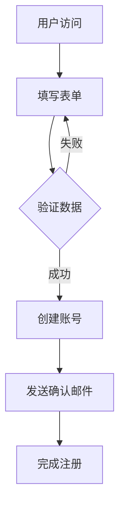
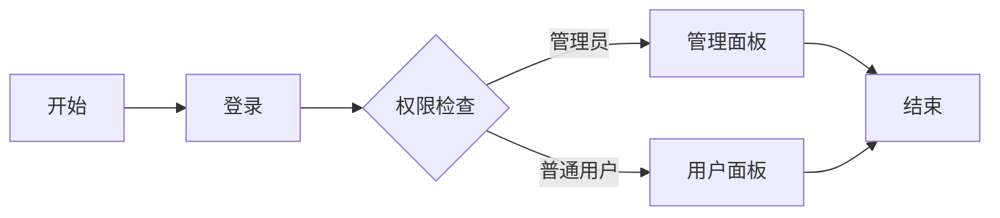
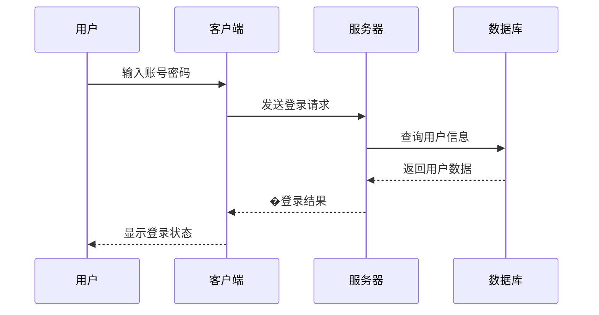
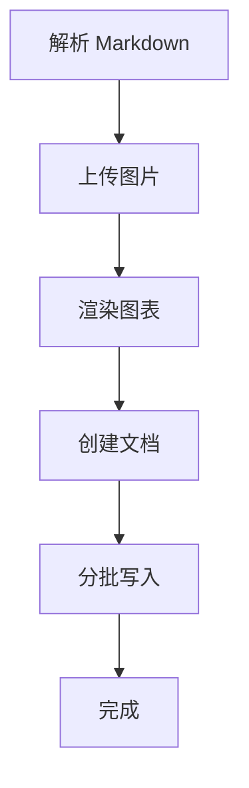
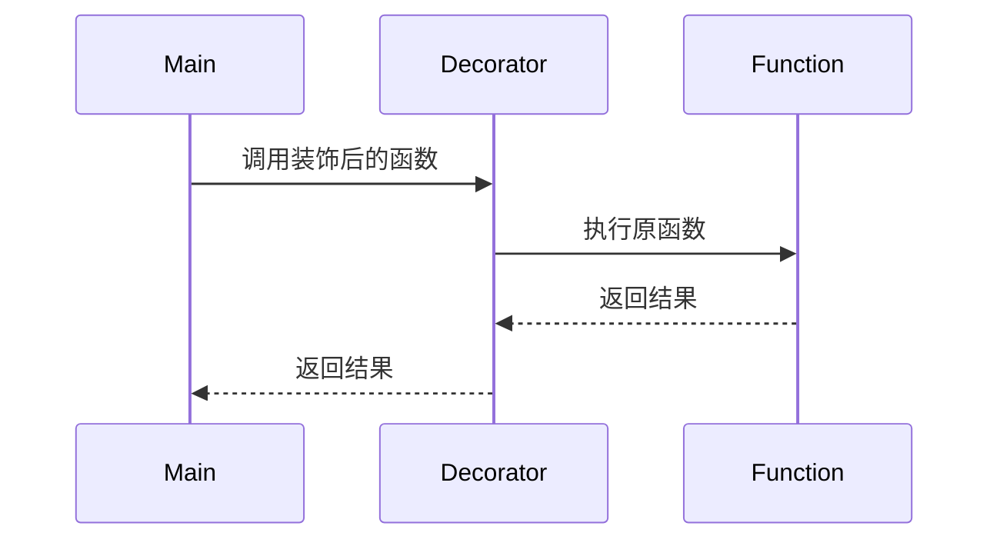

# Feishu Doc Manager 使用示例

本文档提供了 feishu-doc-manager 技能的详细使用示例。

## 目录

- [基础示例](#基础示例)
- [Markdown 示例](#markdown-示例)
- [图片处理示例](#图片处理示例)
- [代码高亮示例](#代码高亮示例)
- [Mermaid 图表示例](#mermaid-图表示例)
- [高级用法](#高级用法)
- [常见场景](#常见场景)

## 基础示例

### 示例 1：同步纯文本

将简单的文本内容同步到飞书文档。

```bash
# 方式 1：使用 --text 参数
python scripts/feishu_api_client.py \
  --text "这是一个测试文档。\n\n包含两个段落。" \
  --title "测试文档"
```

**预期结果**：
- 创建名为"测试文档"的新文档
- 包含两个段落

### 示例 2：预览模式

在实际写入前预览内容结构。

```bash
python scripts/feishu_api_client.py \
  --text "# 标题\n\n内容段落" \
  --title "测试" \
  --preview
```

**输出**：
```
📝 正在解析 Markdown...
🔍 正在搜索现有文档...
✓ 未找到文档，将创建新文档

==================================================
即将写入的内容结构
==================================================
标题: 测试
总块数: 2
批次数: 1

块类型分布:
  - heading1: 1
  - paragraph: 1

是否确认写入？[y/N]:
```

## Markdown 示例

### 示例 3：完整的 Markdown 文档

**文件：project-doc.md**
```markdown
# 项目文档

## 概述

这是一个示例项目，用于演示飞书文档同步功能。

## 功能特性

- 支持 Markdown 语法转换
- 支持图片上传
- 支持代码高亮
- 支持图表渲染

## 使用方法

1. 安装依赖
2. 配置环境变量
3. 运行同步脚本

## 总结

欢迎使用！
```

**同步命令**：
```bash
python scripts/feishu_api_client.py \
  --markdown project-doc.md \
  --title "项目文档" \
  --preview
```

**转换结果**：
- `# 项目文档` → heading1 block
- `## 概述` → heading2 block
- `- 支持...` → bulleted_list block
- `1. 安装...` → ordered_list block

### 示例 4：文本样式

**文件：styles.md**
```markdown
# 文本样式示例

这是**粗体文本**，这是*斜体文本*，这是`行内代码`。

还可以**组合使用**多个`样式`。

也可以使用*斜体和**粗体**组合*。
```

**同步命令**：
```bash
python scripts/feishu_api_client.py \
  --markdown styles.md \
  --title "文本样式示例"
```

## 图片处理示例

### 示例 5：带图片的文档

**目录结构**：
```
project/
├── images/
│   ├── architecture.png
│   └── screenshot.jpg
└── doc-with-images.md
```

**文件：doc-with-images.md**
```markdown
# 系统架构

系统整体架构如下：


## 界面预览

以下是用户界面：


```

**同步命令**：
```bash
python scripts/feishu_api_client.py \
  --markdown doc-with-images.md \
  --title "带图片的文档" \
  --image-dir ./images
```

**处理流程**：
1. 解析 Markdown，找到两个图片引用
2. 上传 `architecture.png` → 获取 `file_token_1`
3. 上传 `screenshot.jpg` → 获取 `file_token_2`
4. 创建文档，插入 image block 引用 token

### 示例 6：网络图片处理

**注意**：飞书不支持直接引用外部 URL 图片。

**错误做法**：
```markdown

```

**正确做法**：
1. 先下载图片到本地
2. 然后按示例 5 的方式上传

```bash
# 下载图片
wget https://example.com/image.png -O ./images/image.png

# 同步文档
python scripts/feishu_api_client.py \
  --markdown doc.md \
  --image-dir ./images \
  --title "文档标题"
```

## 代码高亮示例

### 示例 7：Python 代码

**文件：python-example.md**
```markdown
# Python 代码示例

## Hello World

```python
def hello():
    print("Hello, Feishu!")

if __name__ == "__main__":
    hello()
```

## 数据处理

```python
import pandas as pd

def process_data(file_path):
    df = pd.read_csv(file_path)
    return df.describe()
```
```

**同步命令**：
```bash
python scripts/feishu_api_client.py \
  --markdown python-example.md \
  --title "Python 代码示例"
```

**效果**：
- 代码块会自动识别语言 `python`
- 飞书会提供 Python 语法高亮

### 示例 8：多种语言代码

**文件：multi-lang.md**
```markdown
# 多语言代码示例

## Python

```python
def add(a, b):
    return a + b
```

## JavaScript

```javascript
function add(a, b) {
    return a + b;
}
```

## Go

```go
func add(a int, b int) int {
    return a + b
}
```

## SQL

```sql
SELECT * FROM users WHERE age > 18;
```
```

**同步命令**：
```bash
python scripts/feishu_api_client.py \
  --markdown multi-lang.md \
  --title "多语言代码"
```

## Mermaid 图表示例

### 示例 9：流程图

**文件：flowchart.md**
```markdown
# 流程图示例

## 用户注册流程



## 业务逻辑


```

**同步命令**：
```bash
# 方式 1：使用 --render-mermaid 参数
python scripts/feishu_api_client.py \
  --markdown flowchart.md \
  --title "流程图文档" \
  --render-mermaid
```

**渲染流程**：
1. 识别 ` ```mermaid ` 代码块
2. 提取 Mermaid 代码
3. 调用 `mermaid_renderer.py` 渲染为 PNG
4. 上传 PNG 到飞书
5. 在文档中插入图片 block

### 示例 10：时序图

**文件：sequence.md**
```markdown
# 系统交互时序图

## 登录流程


```

**同步命令**：
```bash
python scripts/feishu_api_client.py \
  --markdown sequence.md \
  --title "时序图文档" \
  --render-mermaid
```

### 示例 11：手动渲染 Mermaid

如果需要单独渲染 Mermaid 图表：

```bash
# 渲染单个图表
python scripts/mermaid_renderer.py \
  "graph TD; A-->B; B-->C;" \
  output.png

# 从文件渲染
echo "graph LR; A-->B;" > diagram.mmd
python scripts/mermaid_renderer.py \
  diagram.mmd \
  output.png \
  --file
```

## 高级用法

### 示例 12：追加到现有文档

首次运行：
```bash
python scripts/feishu_api_client.py \
  --text "第一章：开始" \
  --title "我的文档"
```

输出：`document_id: doxcnxxxxx`

后续追加（自动搜索并追加）：
```bash
python scripts/feishu_api_client.py \
  --text "第二章：发展" \
  --title "我的文档"
```

脚本会自动搜索"我的文档"，找到后追加内容。

### 示例 13：手动指定文档 ID

```bash
python scripts/feishu_api_client.py \
  --text "追加的内容" \
  --document-id "doxcnxxxxxxxxxxxxxx"
```

### 示例 14：大文档分批处理

**场景**：文档有 150 个 blocks

**处理**：
- 第 1 批：blocks 0-49（创建文档）
- 第 2 批：blocks 50-99（追加）
- 第 3 批：blocks 100-149（追加）

**命令**：
```bash
# 自动分批处理
python scripts/feishu_api_client.py \
  --markdown large-doc.md \
  --title "大文档"
```

**输出**：
```
📝 正在解析 Markdown...
📷 正在上传图片...
🔍 正在搜索现有文档...
✓ 未找到文档，将创建新文档
📝 正在写入内容 (共 150 个 blocks)...
  正在写入第 1/3 批...
    ✓ 第 1 批完成
  正在写入第 2/3 批...
    ✓ 第 2 批完成
  正在写入第 3/3 批...
    ✓ 第 3 批完成

✅ 同步完成！
```

### 示例 15：组合使用

**完整文档示例**：`complete.md`

```markdown
# 项目总结报告

## 项目概述

本项目实现了**飞书文档自动同步**功能。

## 技术栈

- Python 3.x
- requests
- pyppeteer

## 架构设计


## 核心代码

```python
class FeishuDocWriter:
    def write(self, content, title):
        blocks = self.parse(content)
        self.upload_images(blocks)
        self.create_document(title, blocks)
```

## 业务流程



## 数据统计

| 指标 | 数值 |
|------|------|
| 代码行数 | 1000+ |
| 测试覆盖 | 85% |
| 文档数量 | 50+ |

## 总结

项目成功实现了所有功能目标。
```

**同步命令**：
```bash
# 使用预览模式先检查
python scripts/feishu_api_client.py \
  --markdown complete.md \
  --title "项目总结报告" \
  --image-dir ./images \
  --render-mermaid \
  --preview

# 确认后正式写入
python scripts/feishu_api_client.py \
  --markdown complete.md \
  --title "项目总结报告" \
  --image-dir ./images \
  --render-mermaid
```

## 常见场景

### 场景 1：会议记录同步

**文件：meeting-notes.md**
```markdown
# 2024-01-03 产品评审会

## 参会人员

- 张三
- 李四
- 王五

## 讨论议题

### 1. 新功能开发

决定开发用户反馈功能，优先级：高。

### 2. 性能优化

建议使用缓存优化响应速度。

## 行动项

1. 张三：完成技术方案（本周五）
2. 李四：评估工作量（下周三）
3. 王五：准备需求文档（本周四）

## 下次会议

时间：2024-01-10 14:00
```

```bash
# 快速同步
python scripts/feishu_api_client.py \
  --markdown meeting-notes.md \
  --title "2024-01-03 产品评审会"
```

### 场景 2：技术文档同步

**文件：api-doc.md**
```markdown
# 用户认证 API

## 接口地址

`POST /api/auth/login`

## 请求参数

```json
{
  "username": "string",
  "password": "string"
}
```

## 响应示例

```json
{
  "code": 0,
  "data": {
    "token": "eyJhbGciOiJIUzI1NiIsInR5cCI6IkpXVCJ9..."
  }
}
```

## 错误码

| 错误码 | 说明 |
|--------|------|
| 1001 | 用户不存在 |
| 1002 | 密码错误 |
```

```bash
python scripts/feishu_api_client.py \
  --markdown api-doc.md \
  --title "用户认证 API"
```

### 场景 3：学习笔记同步

**文件：learning-notes.md**
```markdown
# Python 学习笔记

## 装饰器

装饰器是 Python 的重要特性。

```python
def my_decorator(func):
    def wrapper():
        print("Before")
        func()
        print("After")
    return wrapper

@my_decorator
def say_hello():
    print("Hello!")
```

## 执行流程



## 重点

- 装饰器本质上是一个函数
- 它接收一个函数并返回一个新函数
- 使用 `@` 语法糖简化调用
```

```bash
python scripts/feishu_api_client.py \
  --markdown learning-notes.md \
  --title "Python 学习笔记" \
  --render-mermaid
```

### 场景 4：自动化报告

**Python 脚本**：`generate_report.py`

```python
#!/usr/bin/env python3
import os
import subprocess
from datetime import datetime

# 生成报告内容
report_date = datetime.now().strftime("%Y-%m-%d")
report_content = f"""# 日报 {report_date}

## 今日完成

- 完成功能开发
- 修复 3 个 bug
- 编写单元测试

## 明日计划

- 代码审查
- 性能优化
- 文档更新

## 问题与风险

无
"""

# 保存为临时文件
temp_file = f"report_{report_date}.md"
with open(temp_file, 'w', encoding='utf-8') as f:
    f.write(report_content)

# 同步到飞书
subprocess.run([
    "python", "scripts/feishu_api_client.py",
    "--markdown", temp_file,
    "--title", f"日报 {report_date}"
])

# 清理临时文件
os.remove(temp_file)
print(f"✓ 日报已同步: {report_date}")
```

**运行**：
```bash
python generate_report.py
```

### 场景 5：批量同步多个文档

**脚本**：`batch_sync.py`

```python
#!/usr/bin/env python3
import subprocess
import glob

# 批量同步所有 Markdown 文件
for md_file in glob.glob("docs/**/*.md", recursive=True):
    title = os.path.splitext(os.path.basename(md_file))[0]

    print(f"正在同步: {title}")

    subprocess.run([
        "python", "scripts/feishu_api_client.py",
        "--markdown", md_file,
        "--title", title,
        "--image-dir", "docs/images"
    ])

    print(f"✓ 完成: {title}\n")
```

**运行**：
```bash
python batch_sync.py
```

## 错误处理示例

### 错误 1：环境变量未设置

```bash
$ python scripts/feishu_api_client.py --text "test" --title "test"
❌ 错误：请设置环境变量 FEISHU_APP_ID 和 FEISHU_APP_SECRET

设置方法：
Windows PowerShell:
  $env:FEISHU_APP_ID="your_app_id"
  $env:FEISHU_APP_SECRET="your_app_secret"

Linux/Mac:
  export FEISHU_APP_ID="your_app_id"
  export FEISHU_APP_SECRET="your_app_secret"
```

**解决**：
```bash
# Windows PowerShell
$env:FEISHU_APP_ID="cli_xxxx"
$env:FEISHU_APP_SECRET="xxxxx"

# 再次运行
python scripts/feishu_api_client.py --text "test" --title "test"
```

### 错误 2：图片文件不存在

```bash
$ python scripts/feishu_api_client.py --markdown doc.md --title "test"
📝 正在解析 Markdown...
📷 正在上传图片...
  上传: architecture.png
    ✗ 失败: [Errno 2] No such file or directory: './images/architecture.png'
```

**解决**：
```bash
# 检查图片路径
ls ./images/

# 使用正确的图片目录
python scripts/feishu_api_client.py \
  --markdown doc.md \
  --title "test" \
  --image-dir /path/to/images
```

### 错误 3：Mermaid 渲染失败

```bash
$ python scripts/feishu_api_client.py --markdown doc.md --render-mermaid --title "test"
🎨 正在渲染 Mermaid 图表...
⚠️  警告：未找到 mermaid_renderer.py，跳过 Mermaid 渲染
```

**解决**：
```bash
# 安装渲染工具
npm install -g @mermaid-js/mermaid-cli

# 或
pip install pyppeteer

# 重新运行
python scripts/feishu_api_client.py \
  --markdown doc.md \
  --render-mermaid \
  --title "test"
```

## 最佳实践

1. **使用预览模式**：正式写入前先用 `--preview` 检查
2. **图片命名规范**：使用描述性文件名，如 `architecture-v1.png`
3. **文档标题规范**：统一使用日期或项目名前缀
4. **定期备份**：保存原始 Markdown 文件
5. **分批处理**：大文档考虑分章节同步
6. **环境变量管理**：使用 `.env` 文件管理凭证（不要提交到 git）

## 技巧与窍门

### 技巧 1：快速测试

```bash
# 创建测试文档
echo "# 测试\n\n内容" > test.md

# 同步测试
python scripts/feishu_api_client.py \
  --markdown test.md \
  --title "测试文档" \
  --preview
```

### 技巧 2：模板文档

创建常用模板：
```bash
# 会议记录模板
cp templates/meeting.md meeting-2024-01-03.md

# 填写内容后同步
python scripts/feishu_api_client.py \
  --markdown meeting-2024-01-03.md \
  --title "会议记录 - 2024-01-03"
```

### 技巧 3：增量更新

```bash
# 首次创建
python scripts/feishu_api_client.py \
  --markdown chapter1.md \
  --title "我的书"

# 后续追加章节
python scripts/feishu_api_client.py \
  --markdown chapter2.md \
  --title "我的书"  # 会自动追加
```

### 技巧 4：图片批量处理

```bash
# 批量压缩图片（推荐）
# 使用 ImageMagick 或其他工具压缩后再上传

mogrify -resize 80% -quality 85 ./images/*.png
```

## 总结

feishu-doc-manager 提供了灵活强大的飞书文档同步功能，支持：

- ✅ 纯文本和 Markdown
- ✅ 图片自动上传
- ✅ 代码语法高亮
- ✅ Mermaid 图表渲染
- ✅ 预览模式
- ✅ 分批写入
- ✅ 智能追加
- ✅ 幂等性保证

根据不同场景选择合适的方式，可以极大提高文档同步效率！
