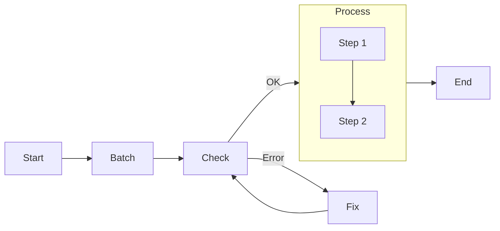

# Pocketflow - Agents

**Pages:** 3

---

## (Advanced) Multi-Agents

**URL:** https://the-pocket.github.io/PocketFlow/design_pattern/multi_agent.html

**Contents:**
- (Advanced) Multi-Agents
  - Example Agent Communication: Message Queue
  - Interactive Multi-Agent Example: Taboo Game

Multiple Agents can work together by handling subtasks and communicating the progress. Communication between agents is typically implemented using message queues in shared storage.

Most of time, you don’t need Multi-Agents. Start with a simple solution first.

Here’s a simple example showing how to implement agent communication using asyncio.Queue. The agent listens for messages, processes them, and continues listening:

Here’s a more complex example where two agents play the word-guessing game Taboo. One agent provides hints while avoiding forbidden words, and another agent tries to guess the target word:

**Examples:**

Example 1 (python):
```python
class AgentNode(AsyncNode):
    async def prep_async(self, _):
        message_queue = self.params["messages"]
        message = await message_queue.get()
        print(f"Agent received: {message}")
        return message

# Create node and flow
agent = AgentNode()
agent >> agent  # connect to self
flow = AsyncFlow(start=agent)

# Create heartbeat sender
async def send_system_messages(message_queue):
    counter = 0
    messages = [
        "System status: all systems operational",
        "Memory usage: normal",
        "Network connectivity: stable",
        "Processing load: optimal"
    ]
    
    while True:
        message = f"{messages[counter % len(messages)]} | timestamp_{counter}"
        await message_queue.put(message)
        counter += 1
        await asyncio.sleep(1)

async def main():
    message_queue = asyncio.Queue()
    shared = {}
    flow.set_params({"messages": message_queue})
    
    # Run both coroutines
    await asyncio.gather(
        flow.run_async(shared),
        send_system_messages(message_queue)
    )
    
asyncio.run(main())
```

Example 2 (unknown):
```unknown
Agent received: System status: all systems operational | timestamp_0
Agent received: Memory usage: normal | timestamp_1
Agent received: Network connectivity: stable | timestamp_2
Agent received: Processing load: optimal | timestamp_3
```

Example 3 (python):
```python
class AsyncHinter(AsyncNode):
    async def prep_async(self, shared):
        guess = await shared["hinter_queue"].get()
        if guess == "GAME_OVER":
            return None
        return shared["target_word"], shared["forbidden_words"], shared.get("past_guesses", [])

    async def exec_async(self, inputs):
        if inputs is None:
            return None
        target, forbidden, past_guesses = inputs
        prompt = f"Generate hint for '{target}'\nForbidden words: {forbidden}"
        if past_guesses:
            prompt += f"\nPrevious wrong guesses: {past_guesses}\nMake hint more specific."
        prompt += "\nUse at most 5 words."
        
        hint = call_llm(prompt)
        print(f"\nHinter: Here's your hint - {hint}")
        return hint

    async def post_async(self, shared, prep_res, exec_res):
        if exec_res is None:
            return "end"
        await shared["guesser_queue"].put(exec_res)
        return "continue"

class AsyncGuesser(AsyncNode):
    async def prep_async(self, shared):
        hint = await shared["guesser_queue"].get()
        return hint, shared.get("past_guesses", [])

    async def exec_async(self, inputs):
        hint, past_guesses = inputs
        prompt = f"Given hint: {hint}, past wrong guesses: {past_guesses}, make a new guess. Directly reply a single word:"
        guess = call_llm(prompt)
        print(f"Guesser: I guess it's - {guess}")
        return guess

    async def post_async(self, shared, prep_res, exec_res):
        if exec_res.lower() == shared["target_word"].lower():
            print("Game Over - Correct guess!")
            await shared["hinter_queue"].put("GAME_OVER")
            return "end"
            
        if "past_guesses" not in shared:
            shared["past_guesses"] = []
        shared["past_guesses"].append(exec_res)
        
        await shared["hinter_queue"].put(exec_res)
        return "continue"

async def main():
    # Set up game
    shared = {
        "target_word": "nostalgia",
        "forbidden_words": ["memory", "past", "remember", "feeling", "longing"],
        "hinter_queue": asyncio.Queue(),
        "guesser_queue": asyncio.Queue()
    }
    
    print("Game starting!")
    print(f"Target word: {shared['target_word']}")
    print(f"Forbidden words: {shared['forbidden_words']}")

    # Initialize by sending empty guess to hinter
    await shared["hinter_queue"].put("")

    # Create nodes and flows
    hinter = AsyncHinter()
    guesser = AsyncGuesser()

    # Set up flows
    hinter_flow = AsyncFlow(start=hinter)
    guesser_flow = AsyncFlow(start=guesser)

    # Connect nodes to themselves
    hinter - "continue" >> hinter
    guesser - "continue" >> guesser

    # Run both agents concurrently
    await asyncio.gather(
        hinter_flow.run_async(shared),
        guesser_flow.run_async(shared)
    )

asyncio.run(main())
```

Example 4 (unknown):
```unknown
Game starting!
Target word: nostalgia
Forbidden words: ['memory', 'past', 'remember', 'feeling', 'longing']

Hinter: Here's your hint - Thinking of childhood summer days
Guesser: I guess it's - popsicle

Hinter: Here's your hint - When childhood cartoons make you emotional
Guesser: I guess it's - nostalgic

Hinter: Here's your hint - When old songs move you
Guesser: I guess it's - memories

Hinter: Here's your hint - That warm emotion about childhood
Guesser: I guess it's - nostalgia
Game Over - Correct guess!
```

---

## Agentic Coding: Humans Design, Agents code!

**URL:** https://the-pocket.github.io/PocketFlow/guide.html

**Contents:**
- Agentic Coding: Humans Design, Agents code!
- Agentic Coding Steps
- Example LLM Project File Structure

If you are an AI agent involved in building LLM Systems, read this guide VERY, VERY carefully! This is the most important chapter in the entire document. Throughout development, you should always (1) start with a small and simple solution, (2) design at a high level (docs/design.md) before implementation, and (3) frequently ask humans for feedback and clarification.

Agentic Coding should be a collaboration between Human System Design and Agent Implementation:

If Humans can’t specify the flow, AI Agents can’t automate it! Before building an LLM system, thoroughly understand the problem and potential solution by manually solving example inputs to develop intuition.

Sometimes, design Utilities before Flow: For example, for an LLM project to automate a legacy system, the bottleneck will likely be the available interface to that system. Start by designing the hardest utilities for interfacing, and then build the flow around them.

Avoid Exception Handling in Utilities: If a utility function is called from a Node’s exec() method, avoid using try...except blocks within the utility. Let the Node’s built-in retry mechanism handle failures.

You’ll likely iterate a lot! Expect to repeat Steps 3–6 hundreds of times.

def call_llm(prompt: str) -> str: client = genai.Client( api_key=os.getenv(“GEMINI_API_KEY”, “”), ) model = os.getenv(“GEMINI_MODEL”, “gemini-2.5-flash”) response = client.models.generate_content(model=model, contents=[prompt]) return response.text

if name == “main”: test_prompt = “Hello, how are you?”

**Examples:**

Example 1 (mermaid):


Example 2 (python):
```python
# utils/call_llm.py
from openai import OpenAI

def call_llm(prompt):    
    client = OpenAI(api_key="YOUR_API_KEY_HERE")
    r = client.chat.completions.create(
        model="gpt-4o",
        messages=[{"role": "user", "content": prompt}]
    )
    return r.choices[0].message.content
          
if __name__ == "__main__":
    prompt = "What is the meaning of life?"
    print(call_llm(prompt))
```

Example 3 (unknown):
```unknown
shared = {
    "user": {
        "id": "user123",
        "context": {                # Another nested dict
            "weather": {"temp": 72, "condition": "sunny"},
            "location": "San Francisco"
        }
    },
    "results": {}                   # Empty dict to store outputs
}
```

Example 4 (unknown):
```unknown
my_project/
├── main.py
├── nodes.py
├── flow.py
├── utils/
│   ├── __init__.py
│   ├── call_llm.py
│   └── search_web.py
├── requirements.txt
└── docs/
    └── design.md
```

---

## Agent

**URL:** https://the-pocket.github.io/PocketFlow/design_pattern/agent.html

**Contents:**
- Agent
- Implement Agent with Graph
- Example Good Action Design
- Example: Search Agent

Agent is a powerful design pattern in which nodes can take dynamic actions based on the context.

The core of building high-performance and reliable agents boils down to:

Context Management: Provide relevant, minimal context. For example, rather than including an entire chat history, retrieve the most relevant via RAG. Even with larger context windows, LLMs still fall victim to “lost in the middle”, overlooking mid-prompt content.

Action Space: Provide a well-structured and unambiguous set of actions—avoiding overlap like separate read_databases or read_csvs. Instead, import CSVs into the database.

Incremental: Feed content in manageable chunks (500 lines or 1 page) instead of all at once.

Overview-zoom-in: First provide high-level structure (table of contents, summary), then allow drilling into details (raw texts).

Parameterized/Programmable: Instead of fixed actions, enable parameterized (columns to select) or programmable (SQL queries) actions, for example, to read CSV files.

Backtracking: Let the agent undo the last step instead of restarting entirely, preserving progress when encountering errors or dead ends.

**Examples:**

Example 1 (unknown):
```unknown
f"""
### CONTEXT
Task: {task_description}
Previous Actions: {previous_actions}
Current State: {current_state}

### ACTION SPACE
[1] search
  Description: Use web search to get results
  Parameters:
    - query (str): What to search for

[2] answer
  Description: Conclude based on the results
  Parameters:
    - result (str): Final answer to provide

### NEXT ACTION
Decide the next action based on the current context and available action space.
Return your response in the following format:

```yaml
thinking: |
    <your step-by-step reasoning process>
action: <action_name>
parameters:
    <parameter_name>: <parameter_value>
```"""
```

Example 2 (python):
```python
class DecideAction(Node):
    def prep(self, shared):
        context = shared.get("context", "No previous search")
        query = shared["query"]
        return query, context
        
    def exec(self, inputs):
        query, context = inputs
        prompt = f"""
Given input: {query}
Previous search results: {context}
Should I: 1) Search web for more info 2) Answer with current knowledge
Output in yaml:
```yaml
action: search/answer
reason: why this action
search_term: search phrase if action is search
```"""
        resp = call_llm(prompt)
        yaml_str = resp.split("```yaml")[1].split("```")[0].strip()
        result = yaml.safe_load(yaml_str)
        
        assert isinstance(result, dict)
        assert "action" in result
        assert "reason" in result
        assert result["action"] in ["search", "answer"]
        if result["action"] == "search":
            assert "search_term" in result
        
        return result

    def post(self, shared, prep_res, exec_res):
        if exec_res["action"] == "search":
            shared["search_term"] = exec_res["search_term"]
        return exec_res["action"]

class SearchWeb(Node):
    def prep(self, shared):
        return shared["search_term"]
        
    def exec(self, search_term):
        return search_web(search_term)
    
    def post(self, shared, prep_res, exec_res):
        prev_searches = shared.get("context", [])
        shared["context"] = prev_searches + [
            {"term": shared["search_term"], "result": exec_res}
        ]
        return "decide"
        
class DirectAnswer(Node):
    def prep(self, shared):
        return shared["query"], shared.get("context", "")
        
    def exec(self, inputs):
        query, context = inputs
        return call_llm(f"Context: {context}\nAnswer: {query}")

    def post(self, shared, prep_res, exec_res):
       print(f"Answer: {exec_res}")
       shared["answer"] = exec_res

# Connect nodes
decide = DecideAction()
search = SearchWeb()
answer = DirectAnswer()

decide - "search" >> search
decide - "answer" >> answer
search - "decide" >> decide  # Loop back

flow = Flow(start=decide)
flow.run({"query": "Who won the Nobel Prize in Physics 2024?"})
```

---
