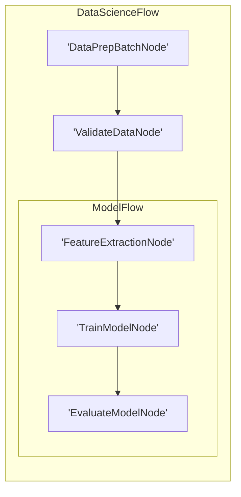

# Pocketflow - Api

**Pages:** 6

---

## LLM Wrappers

**URL:** https://the-pocket.github.io/PocketFlow/utility_function/llm.html

**Contents:**
- LLM Wrappers
- Improvements

Check out libraries like litellm. Here, we provide some minimal example implementations:

Store the API key in an environment variable like OPENAI_API_KEY for security.

Feel free to enhance your call_llm function as needed. Here are examples:

⚠️ Caching conflicts with Node retries, as retries yield the same result.

To address this, you could use cached results only if not retried.

**Examples:**

Example 1 (python):
```python
def call_llm(prompt):
     from openai import OpenAI
     client = OpenAI(api_key="YOUR_API_KEY_HERE")
     r = client.chat.completions.create(
         model="gpt-4o",
         messages=[{"role": "user", "content": prompt}]
     )
     return r.choices[0].message.content

 # Example usage
 call_llm("How are you?")
```

Example 2 (python):
```python
def call_llm(prompt):
     from anthropic import Anthropic
     client = Anthropic(api_key="YOUR_API_KEY_HERE")
     r = client.messages.create(
         model="claude-sonnet-4-0",
         messages=[
             {"role": "user", "content": prompt}
         ]
     )
     return r.content[0].text
```

Example 3 (python):
```python
def call_llm(prompt):
 from google import genai
 client = genai.Client(api_key='GEMINI_API_KEY')
     response = client.models.generate_content(
     model='gemini-2.5-pro',
     contents=prompt
 )
 return response.text
```

Example 4 (python):
```python
def call_llm(prompt):
     from openai import AzureOpenAI
     client = AzureOpenAI(
         azure_endpoint="https://<YOUR_RESOURCE_NAME>.openai.azure.com/",
         api_key="YOUR_API_KEY_HERE",
         api_version="2023-05-15"
     )
     r = client.chat.completions.create(
         model="<YOUR_DEPLOYMENT_NAME>",
         messages=[{"role": "user", "content": prompt}]
     )
     return r.choices[0].message.content
```

---

## Text Chunking

**URL:** https://the-pocket.github.io/PocketFlow/utility_function/chunking.html

**Contents:**
- Text Chunking
- Example Python Code Samples
  - 1. Naive (Fixed-Size) Chunking
  - 2. Sentence-Based Chunking
  - 3. Other Chunking

We recommend some implementations of commonly used text chunking approaches.

Text Chunking is more a micro optimization, compared to the Flow Design.

It’s recommended to start with the Naive Chunking and optimize later.

Splits text by a fixed number of words, ignoring sentence or semantic boundaries.

However, sentences are often cut awkwardly, losing coherence.

However, might not handle very long sentences or paragraphs well.

**Examples:**

Example 1 (python):
```python
def fixed_size_chunk(text, chunk_size=100):
    chunks = []
    for i in range(0, len(text), chunk_size):
        chunks.append(text[i : i + chunk_size])
    return chunks
```

Example 2 (python):
```python
import nltk

def sentence_based_chunk(text, max_sentences=2):
    sentences = nltk.sent_tokenize(text)
    chunks = []
    for i in range(0, len(sentences), max_sentences):
        chunks.append(" ".join(sentences[i : i + max_sentences]))
    return chunks
```

---

## Text-to-Speech

**URL:** https://the-pocket.github.io/PocketFlow/utility_function/text_to_speech.html

**Contents:**
- Text-to-Speech
- Example Python Code
  - Amazon Polly
  - Google Cloud TTS
  - Azure TTS
  - IBM Watson TTS
  - ElevenLabs

**Examples:**

Example 1 (python):
```python
import boto3

polly = boto3.client("polly", region_name="us-east-1",
                     aws_access_key_id="YOUR_AWS_ACCESS_KEY_ID",
                     aws_secret_access_key="YOUR_AWS_SECRET_ACCESS_KEY")

resp = polly.synthesize_speech(
    Text="Hello from Polly!",
    OutputFormat="mp3",
    VoiceId="Joanna"
)

with open("polly.mp3", "wb") as f:
    f.write(resp["AudioStream"].read())
```

Example 2 (python):
```python
from google.cloud import texttospeech

client = texttospeech.TextToSpeechClient()
input_text = texttospeech.SynthesisInput(text="Hello from Google Cloud TTS!")
voice = texttospeech.VoiceSelectionParams(language_code="en-US")
audio_cfg = texttospeech.AudioConfig(audio_encoding=texttospeech.AudioEncoding.MP3)

resp = client.synthesize_speech(input=input_text, voice=voice, audio_config=audio_cfg)

with open("gcloud_tts.mp3", "wb") as f:
    f.write(resp.audio_content)
```

Example 3 (python):
```python
import azure.cognitiveservices.speech as speechsdk

speech_config = speechsdk.SpeechConfig(
    subscription="AZURE_KEY", region="AZURE_REGION")
audio_cfg = speechsdk.audio.AudioConfig(filename="azure_tts.wav")

synthesizer = speechsdk.SpeechSynthesizer(
    speech_config=speech_config,
    audio_config=audio_cfg
)

synthesizer.speak_text_async("Hello from Azure TTS!").get()
```

Example 4 (python):
```python
from ibm_watson import TextToSpeechV1
from ibm_cloud_sdk_core.authenticators import IAMAuthenticator

auth = IAMAuthenticator("IBM_API_KEY")
service = TextToSpeechV1(authenticator=auth)
service.set_service_url("IBM_SERVICE_URL")

resp = service.synthesize(
    "Hello from IBM Watson!",
    voice="en-US_AllisonV3Voice",
    accept="audio/mp3"
).get_result()

with open("ibm_tts.mp3", "wb") as f:
    f.write(resp.content)
```

---

## Vector Databases

**URL:** https://the-pocket.github.io/PocketFlow/utility_function/vector.html

**Contents:**
- Vector Databases
- Example Python Code
  - FAISS
  - Pinecone
  - Qdrant
  - Weaviate
  - Milvus
  - Chroma
  - Redis

Below is a table of the popular vector search solutions:

Below are basic usage snippets for each tool.

**Examples:**

Example 1 (unknown):
```unknown
import faiss
import numpy as np

# Dimensionality of embeddings
d = 128

# Create a flat L2 index
index = faiss.IndexFlatL2(d)

# Random vectors
data = np.random.random((1000, d)).astype('float32')
index.add(data)

# Query
query = np.random.random((1, d)).astype('float32')
D, I = index.search(query, k=5)

print("Distances:", D)
print("Neighbors:", I)
```

Example 2 (unknown):
```unknown
import pinecone

pinecone.init(api_key="YOUR_API_KEY", environment="YOUR_ENV")

index_name = "my-index"

# Create the index if it doesn't exist
if index_name not in pinecone.list_indexes():
    pinecone.create_index(name=index_name, dimension=128)

# Connect
index = pinecone.Index(index_name)

# Upsert
vectors = [
    ("id1", [0.1]*128),
    ("id2", [0.2]*128)
]
index.upsert(vectors)

# Query
response = index.query([[0.15]*128], top_k=3)
print(response)
```

Example 3 (python):
```python
import qdrant_client
from qdrant_client.models import Distance, VectorParams, PointStruct

client = qdrant_client.QdrantClient(
    url="https://YOUR-QDRANT-CLOUD-ENDPOINT",
    api_key="YOUR_API_KEY"
)

collection = "my_collection"
client.recreate_collection(
    collection_name=collection,
    vectors_config=VectorParams(size=128, distance=Distance.COSINE)
)

points = [
    PointStruct(id=1, vector=[0.1]*128, payload={"type": "doc1"}),
    PointStruct(id=2, vector=[0.2]*128, payload={"type": "doc2"}),
]

client.upsert(collection_name=collection, points=points)

results = client.search(
    collection_name=collection,
    query_vector=[0.15]*128,
    limit=2
)
print(results)
```

Example 4 (unknown):
```unknown
import weaviate

client = weaviate.Client("https://YOUR-WEAVIATE-CLOUD-ENDPOINT")

schema = {
    "classes": [
        {
            "class": "Article",
            "vectorizer": "none"
        }
    ]
}
client.schema.create(schema)

obj = {
    "title": "Hello World",
    "content": "Weaviate vector search"
}
client.data_object.create(obj, "Article", vector=[0.1]*128)

resp = (
    client.query
    .get("Article", ["title", "content"])
    .with_near_vector({"vector": [0.15]*128})
    .with_limit(3)
    .do()
)
print(resp)
```

---

## Visualization and Debugging

**URL:** https://the-pocket.github.io/PocketFlow/utility_function/viz.html

**Contents:**
- Visualization and Debugging
- 1. Visualization with Mermaid
- 2. Call Stack Debugging

Similar to LLM wrappers, we don’t provide built-in visualization and debugging. Here, we recommend some minimal (and incomplete) implementations These examples can serve as a starting point for your own tooling.

This code recursively traverses the nested graph, assigns unique IDs to each node, and treats Flow nodes as subgraphs to generate Mermaid syntax for a hierarchical visualization.

For example, suppose we have a complex Flow for data science:

The code generates a Mermaid diagram:

For visualization based on d3.js, check out the cookbook.

It would be useful to print the Node call stacks for debugging. This can be achieved by inspecting the runtime call stack:

For example, suppose we have a complex Flow for data science:

The output would be: Call stack: ['EvaluateModelNode', 'ModelFlow', 'DataScienceFlow']

For a more complete implementation, check out the cookbook.

**Examples:**

Example 1 (python):
```python
def build_mermaid(start):
    ids, visited, lines = {}, set(), ["graph LR"]
    ctr = 1
    def get_id(n):
        nonlocal ctr
        return ids[n] if n in ids else (ids.setdefault(n, f"N{ctr}"), (ctr := ctr + 1))[0]
    def link(a, b):
        lines.append(f"    {a} --> {b}")
    def walk(node, parent=None):
        if node in visited:
            return parent and link(parent, get_id(node))
        visited.add(node)
        if isinstance(node, Flow):
            node.start_node and parent and link(parent, get_id(node.start_node))
            lines.append(f"\n    subgraph sub_flow_{get_id(node)}[{type(node).__name__}]")
            node.start_node and walk(node.start_node)
            for nxt in node.successors.values():
                node.start_node and walk(nxt, get_id(node.start_node)) or (parent and link(parent, get_id(nxt))) or walk(nxt)
            lines.append("    end\n")
        else:
            lines.append(f"    {(nid := get_id(node))}['{type(node).__name__}']")
            parent and link(parent, nid)
            [walk(nxt, nid) for nxt in node.successors.values()]
    walk(start)
    return "\n".join(lines)
```

Example 2 (python):
```python
class DataPrepBatchNode(BatchNode):
    def prep(self,shared): return []
class ValidateDataNode(Node): pass
class FeatureExtractionNode(Node): pass
class TrainModelNode(Node): pass
class EvaluateModelNode(Node): pass
class ModelFlow(Flow): pass
class DataScienceFlow(Flow):pass

feature_node = FeatureExtractionNode()
train_node = TrainModelNode()
evaluate_node = EvaluateModelNode()
feature_node >> train_node >> evaluate_node
model_flow = ModelFlow(start=feature_node)
data_prep_node = DataPrepBatchNode()
validate_node = ValidateDataNode()
data_prep_node >> validate_node >> model_flow
data_science_flow = DataScienceFlow(start=data_prep_node)
result = build_mermaid(start=data_science_flow)
```

Example 3 (mermaid):


Example 4 (python):
```python
import inspect

def get_node_call_stack():
    stack = inspect.stack()
    node_names = []
    seen_ids = set()
    for frame_info in stack[1:]:
        local_vars = frame_info.frame.f_locals
        if 'self' in local_vars:
            caller_self = local_vars['self']
            if isinstance(caller_self, BaseNode) and id(caller_self) not in seen_ids:
                seen_ids.add(id(caller_self))
                node_names.append(type(caller_self).__name__)
    return node_names
```

---

## Web Search

**URL:** https://the-pocket.github.io/PocketFlow/utility_function/websearch.html

**Contents:**
- Web Search
- Example Python Code
  - 1. Google Custom Search JSON API
  - 2. Bing Web Search API
  - 3. DuckDuckGo Instant Answer
  - 4. Brave Search API
  - 5. SerpApi

We recommend some implementations of commonly used web search tools.

**Examples:**

Example 1 (unknown):
```unknown
import requests

API_KEY = "YOUR_API_KEY"
CX_ID = "YOUR_CX_ID"
query = "example"

url = "https://www.googleapis.com/customsearch/v1"
params = {
    "key": API_KEY,
    "cx": CX_ID,
    "q": query
}

response = requests.get(url, params=params)
results = response.json()
print(results)
```

Example 2 (unknown):
```unknown
import requests

SUBSCRIPTION_KEY = "YOUR_BING_API_KEY"
query = "example"

url = "https://api.bing.microsoft.com/v7.0/search"
headers = {"Ocp-Apim-Subscription-Key": SUBSCRIPTION_KEY}
params = {"q": query}

response = requests.get(url, headers=headers, params=params)
results = response.json()
print(results)
```

Example 3 (unknown):
```unknown
import requests

query = "example"
url = "https://api.duckduckgo.com/"
params = {
    "q": query,
    "format": "json"
}

response = requests.get(url, params=params)
results = response.json()
print(results)
```

Example 4 (unknown):
```unknown
import requests

SUBSCRIPTION_TOKEN = "YOUR_BRAVE_API_TOKEN"
query = "example"

url = "https://api.search.brave.com/res/v1/web/search"
headers = {
    "X-Subscription-Token": SUBSCRIPTION_TOKEN
}
params = {
    "q": query
}

response = requests.get(url, headers=headers, params=params)
results = response.json()
print(results)
```

---
