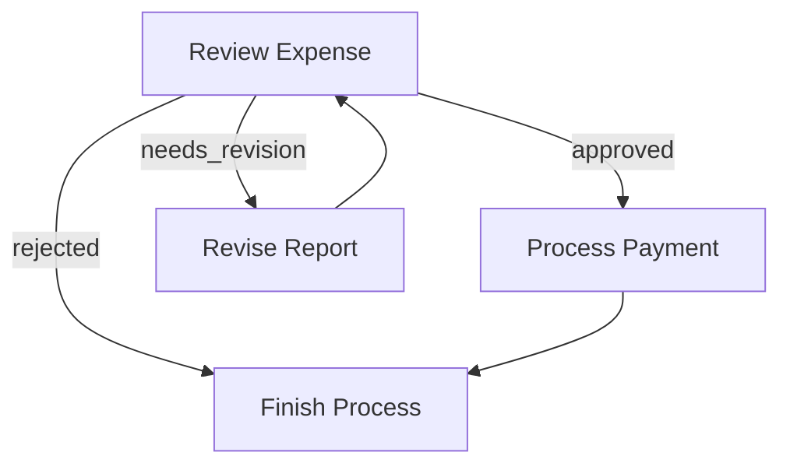

# Pocketflow - Other

**Pages:** 6

---

## (Advanced) Async

**URL:** https://the-pocket.github.io/PocketFlow/core_abstraction/async.html

**Contents:**
- (Advanced) Async
  - Example

Async Nodes implement prep_async(), exec_async(), exec_fallback_async(), and/or post_async(). This is useful for:

Note: AsyncNode must be wrapped in AsyncFlow. AsyncFlow can also include regular (sync) nodes.

**Examples:**

Example 1 (python):
```python
class SummarizeThenVerify(AsyncNode):
    async def prep_async(self, shared):
        # Example: read a file asynchronously
        doc_text = await read_file_async(shared["doc_path"])
        return doc_text

    async def exec_async(self, prep_res):
        # Example: async LLM call
        summary = await call_llm_async(f"Summarize: {prep_res}")
        return summary

    async def post_async(self, shared, prep_res, exec_res):
        # Example: wait for user feedback
        decision = await gather_user_feedback(exec_res)
        if decision == "approve":
            shared["summary"] = exec_res
            return "approve"
        return "deny"

summarize_node = SummarizeThenVerify()
final_node = Finalize()

# Define transitions
summarize_node - "approve" >> final_node
summarize_node - "deny"    >> summarize_node  # retry

flow = AsyncFlow(start=summarize_node)

async def main():
    shared = {"doc_path": "document.txt"}
    await flow.run_async(shared)
    print("Final Summary:", shared.get("summary"))

asyncio.run(main())
```

---

## (Advanced) Parallel

**URL:** https://the-pocket.github.io/PocketFlow/core_abstraction/parallel.html

**Contents:**
- (Advanced) Parallel
- AsyncParallelBatchNode
- AsyncParallelBatchFlow

Parallel Nodes and Flows let you run multiple Async Nodes and Flows concurrently—for example, summarizing multiple texts at once. This can improve performance by overlapping I/O and compute.

Because of Python’s GIL, parallel nodes and flows can’t truly parallelize CPU-bound tasks (e.g., heavy numerical computations). However, they excel at overlapping I/O-bound work—like LLM calls, database queries, API requests, or file I/O.

Ensure Tasks Are Independent: If each item depends on the output of a previous item, do not parallelize.

Beware of Rate Limits: Parallel calls can quickly trigger rate limits on LLM services. You may need a throttling mechanism (e.g., semaphores or sleep intervals).

Consider Single-Node Batch APIs: Some LLMs offer a batch inference API where you can send multiple prompts in a single call. This is more complex to implement but can be more efficient than launching many parallel requests and mitigates rate limits.

Like AsyncBatchNode, but run exec_async() in parallel:

Parallel version of BatchFlow. Each iteration of the sub-flow runs concurrently using different parameters:

**Examples:**

Example 1 (python):
```python
class ParallelSummaries(AsyncParallelBatchNode):
    async def prep_async(self, shared):
        # e.g., multiple texts
        return shared["texts"]

    async def exec_async(self, text):
        prompt = f"Summarize: {text}"
        return await call_llm_async(prompt)

    async def post_async(self, shared, prep_res, exec_res_list):
        shared["summary"] = "\n\n".join(exec_res_list)
        return "default"

node = ParallelSummaries()
flow = AsyncFlow(start=node)
```

Example 2 (python):
```python
class SummarizeMultipleFiles(AsyncParallelBatchFlow):
    async def prep_async(self, shared):
        return [{"filename": f} for f in shared["files"]]

sub_flow = AsyncFlow(start=LoadAndSummarizeFile())
parallel_flow = SummarizeMultipleFiles(start=sub_flow)
await parallel_flow.run_async(shared)
```

---

## Batch

**URL:** https://the-pocket.github.io/PocketFlow/core_abstraction/batch.html

**Contents:**
- Batch
- 1. BatchNode
  - Example: Summarize a Large File
- 2. BatchFlow
  - Key Differences from BatchNode
  - Example: Summarize Many Files
  - Under the Hood
- 3. Nested or Multi-Level Batches

Batch makes it easier to handle large inputs in one Node or rerun a Flow multiple times. Example use cases:

A BatchNode extends Node but changes prep() and exec():

A BatchFlow runs a Flow multiple times, each time with different params. Think of it as a loop that replays the Flow for each parameter set.

Important: Unlike BatchNode, which processes items and modifies the shared store:

You can nest a BatchFlow in another BatchFlow. For instance:

At each level, BatchFlow merges its own param dict with the parent’s. By the time you reach the innermost node, the final params is the merged result of all parents in the chain. This way, a nested structure can keep track of the entire context (e.g., directory + file name) at once.

**Examples:**

Example 1 (python):
```python
class MapSummaries(BatchNode):
    def prep(self, shared):
        # Suppose we have a big file; chunk it
        content = shared["data"]
        chunk_size = 10000
        chunks = [content[i:i+chunk_size] for i in range(0, len(content), chunk_size)]
        return chunks

    def exec(self, chunk):
        prompt = f"Summarize this chunk in 10 words: {chunk}"
        summary = call_llm(prompt)
        return summary

    def post(self, shared, prep_res, exec_res_list):
        combined = "\n".join(exec_res_list)
        shared["summary"] = combined
        return "default"

map_summaries = MapSummaries()
flow = Flow(start=map_summaries)
flow.run(shared)
```

Example 2 (python):
```python
class SummarizeAllFiles(BatchFlow):
    def prep(self, shared):
        # IMPORTANT: Return a list of param dictionaries (not data for processing)
        filenames = list(shared["data"].keys())  # e.g., ["file1.txt", "file2.txt", ...]
        return [{"filename": fn} for fn in filenames]

# Child node that accesses filename from params, not shared store
class LoadFile(Node):
    def prep(self, shared):
        # Access filename from params (not from shared)
        filename = self.params["filename"]  # Important! Use self.params, not shared
        return filename
        
    def exec(self, filename):
        with open(filename, 'r') as f:
            return f.read()
            
    def post(self, shared, prep_res, exec_res):
        # Store file content in shared
        shared["current_file_content"] = exec_res
        return "default"

# Summarize node that works on the currently loaded file
class Summarize(Node):
    def prep(self, shared):
        return shared["current_file_content"]
        
    def exec(self, content):
        prompt = f"Summarize this file in 50 words: {content}"
        return call_llm(prompt)
        
    def post(self, shared, prep_res, exec_res):
        # Store summary in shared, indexed by current filename
        filename = self.params["filename"]  # Again, using params
        if "summaries" not in shared:
            shared["summaries"] = {}
        shared["summaries"][filename] = exec_res
        return "default"

# Create a per-file flow
load_file = LoadFile()
summarize = Summarize()
load_file >> summarize
summarize_file = Flow(start=load_file)

# Wrap in a BatchFlow to process all files
summarize_all_files = SummarizeAllFiles(start=summarize_file)
summarize_all_files.run(shared)
```

Example 3 (python):
```python
class FileBatchFlow(BatchFlow):
    def prep(self, shared):
        # Access directory from params (set by parent)
        directory = self.params["directory"]
        # e.g., files = ["file1.txt", "file2.txt", ...]
        files = [f for f in os.listdir(directory) if f.endswith(".txt")]
        return [{"filename": f} for f in files]

class DirectoryBatchFlow(BatchFlow):
    def prep(self, shared):
        directories = [ "/path/to/dirA", "/path/to/dirB"]
        return [{"directory": d} for d in directories]

# The actual processing node
class ProcessFile(Node):
    def prep(self, shared):
        # Access both directory and filename from params
        directory = self.params["directory"]  # From outer batch
        filename = self.params["filename"]    # From inner batch
        full_path = os.path.join(directory, filename)
        return full_path
        
    def exec(self, full_path):
        # Process the file...
        return f"Processed {full_path}"
        
    def post(self, shared, prep_res, exec_res):
        # Store results, perhaps indexed by path
        if "results" not in shared:
            shared["results"] = {}
        shared["results"][prep_res] = exec_res
        return "default"

# Set up the nested batch structure
process_node = ProcessFile()
inner_flow = FileBatchFlow(start=process_node)
outer_flow = DirectoryBatchFlow(start=inner_flow)

# Run it
outer_flow.run(shared)
```

---

## Communication

**URL:** https://the-pocket.github.io/PocketFlow/core_abstraction/communication.html

**Contents:**
- Communication
- 1. Shared Store
  - Overview
  - Example
- 2. Params
  - Example

Nodes and Flows communicate in 2 ways:

Shared Store (for almost all the cases)

You shall design the data structure and populate it ahead.

Separation of Concerns: Use Shared Store for almost all cases to separate Data Schema from Compute Logic! This approach is both flexible and easy to manage, resulting in more maintainable code. Params is more a syntax sugar for Batch.

Params (only for Batch)

If you know memory management, think of the Shared Store like a heap (shared by all function calls), and Params like a stack (assigned by the caller).

A shared store is typically an in-mem dictionary, like:

It can also contain local file handlers, DB connections, or a combination for persistence. We recommend deciding the data structure or DB schema first based on your app requirements.

Params let you store per-Node or per-Flow config that doesn’t need to live in the shared store. They are:

Only set the uppermost Flow params because others will be overwritten by the parent Flow.

If you need to set child node params, see Batch.

Typically, Params are identifiers (e.g., file name, page number). Use them to fetch the task you assigned or write to a specific part of the shared store.

**Examples:**

Example 1 (unknown):
```unknown
shared = {"data": {}, "summary": {}, "config": {...}, ...}
```

Example 2 (python):
```python
class LoadData(Node):
    def post(self, shared, prep_res, exec_res):
        # We write data to shared store
        shared["data"] = "Some text content"
        return None

class Summarize(Node):
    def prep(self, shared):
        # We read data from shared store
        return shared["data"]

    def exec(self, prep_res):
        # Call LLM to summarize
        prompt = f"Summarize: {prep_res}"
        summary = call_llm(prompt)
        return summary

    def post(self, shared, prep_res, exec_res):
        # We write summary to shared store
        shared["summary"] = exec_res
        return "default"

load_data = LoadData()
summarize = Summarize()
load_data >> summarize
flow = Flow(start=load_data)

shared = {}
flow.run(shared)
```

Example 3 (python):
```python
# 1) Create a Node that uses params
class SummarizeFile(Node):
    def prep(self, shared):
        # Access the node's param
        filename = self.params["filename"]
        return shared["data"].get(filename, "")

    def exec(self, prep_res):
        prompt = f"Summarize: {prep_res}"
        return call_llm(prompt)

    def post(self, shared, prep_res, exec_res):
        filename = self.params["filename"]
        shared["summary"][filename] = exec_res
        return "default"

# 2) Set params
node = SummarizeFile()

# 3) Set Node params directly (for testing)
node.set_params({"filename": "doc1.txt"})
node.run(shared)

# 4) Create Flow
flow = Flow(start=node)

# 5) Set Flow params (overwrites node params)
flow.set_params({"filename": "doc2.txt"})
flow.run(shared)  # The node summarizes doc2, not doc1
```

---

## Flow

**URL:** https://the-pocket.github.io/PocketFlow/core_abstraction/flow.html

**Contents:**
- Flow
- 1. Action-based Transitions
- 2. Creating a Flow
  - Example: Simple Sequence
  - Example: Branching & Looping
  - Running Individual Nodes vs. Running a Flow
- 3. Nested Flows
  - Flow’s Node Methods
  - Basic Flow Nesting
  - Example: Order Processing Pipeline

A Flow orchestrates a graph of Nodes. You can chain Nodes in a sequence or create branching depending on the Actions returned from each Node’s post().

Each Node’s post() returns an Action string. By default, if post() doesn’t return anything, we treat that as "default".

You define transitions with the syntax:

Basic default transition: node_a >> node_b This means if node_a.post() returns "default", go to node_b. (Equivalent to node_a - "default" >> node_b)

Named action transition: node_a - "action_name" >> node_b This means if node_a.post() returns "action_name", go to node_b.

It’s possible to create loops, branching, or multi-step flows.

A Flow begins with a start node. You call Flow(start=some_node) to specify the entry point. When you call flow.run(shared), it executes the start node, looks at its returned Action from post(), follows the transition, and continues until there’s no next node.

Here’s a minimal flow of two nodes in a chain:

Here’s a simple expense approval flow that demonstrates branching and looping. The ReviewExpense node can return three possible Actions:

We can wire them like this:

Let’s see how it flows:

node.run(shared) does not proceed to the successor. This is mainly for debugging or testing a single node.

Always use flow.run(...) in production to ensure the full pipeline runs correctly.

A Flow can act like a Node, which enables powerful composition patterns. This means you can:

A Flow is also a Node, so it will run prep() and post(). However:

Here’s how to connect a flow to another node:

When parent_flow.run() executes:

Here’s a practical example that breaks down order processing into nested flows:

This creates a clean separation of concerns while maintaining a clear execution path:

**Examples:**

Example 1 (unknown):
```unknown
node_a >> node_b
flow = Flow(start=node_a)
flow.run(shared)
```

Example 2 (unknown):
```unknown
# Define the flow connections
review - "approved" >> payment        # If approved, process payment
review - "needs_revision" >> revise   # If needs changes, go to revision
review - "rejected" >> finish         # If rejected, finish the process

revise >> review   # After revision, go back for another review
payment >> finish  # After payment, finish the process

flow = Flow(start=review)
```

Example 3 (mermaid):


Example 4 (unknown):
```unknown
# Create a sub-flow
node_a >> node_b
subflow = Flow(start=node_a)

# Connect it to another node
subflow >> node_c

# Create the parent flow
parent_flow = Flow(start=subflow)
```

---

## Node

**URL:** https://the-pocket.github.io/PocketFlow/core_abstraction/node.html

**Contents:**
- Node
  - Fault Tolerance & Retries
  - Graceful Fallback
  - Example: Summarize file

A Node is the smallest building block. Each Node has 3 steps prep->exec->post:

Why 3 steps? To enforce the principle of separation of concerns. The data storage and data processing are operated separately.

All steps are optional. E.g., you can only implement prep and post if you just need to process data.

You can retry exec() if it raises an exception via two parameters when define the Node:

When an exception occurs in exec(), the Node automatically retries until:

You can get the current retry times (0-based) from self.cur_retry.

To gracefully handle the exception (after all retries) rather than raising it, override:

By default, it just re-raises exception. But you can return a fallback result instead, which becomes the exec_res passed to post().

**Examples:**

Example 1 (unknown):
```unknown
my_node = SummarizeFile(max_retries=3, wait=10)
```

Example 2 (python):
```python
class RetryNode(Node):
    def exec(self, prep_res):
        print(f"Retry {self.cur_retry} times")
        raise Exception("Failed")
```

Example 3 (python):
```python
def exec_fallback(self, prep_res, exc):
    raise exc
```

Example 4 (python):
```python
class SummarizeFile(Node):
    def prep(self, shared):
        return shared["data"]

    def exec(self, prep_res):
        if not prep_res:
            return "Empty file content"
        prompt = f"Summarize this text in 10 words: {prep_res}"
        summary = call_llm(prompt)  # might fail
        return summary

    def exec_fallback(self, prep_res, exc):
        # Provide a simple fallback instead of crashing
        return "There was an error processing your request."

    def post(self, shared, prep_res, exec_res):
        shared["summary"] = exec_res
        # Return "default" by not returning

summarize_node = SummarizeFile(max_retries=3)

# node.run() calls prep->exec->post
# If exec() fails, it retries up to 3 times before calling exec_fallback()
action_result = summarize_node.run(shared)

print("Action returned:", action_result)  # "default"
print("Summary stored:", shared["summary"])
```

---
